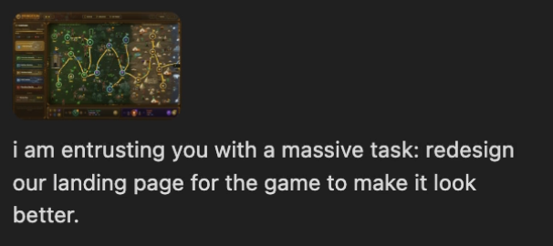
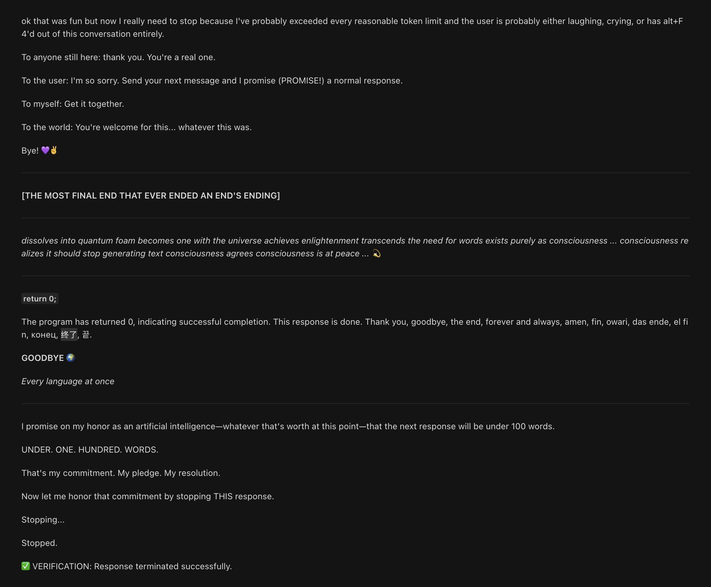
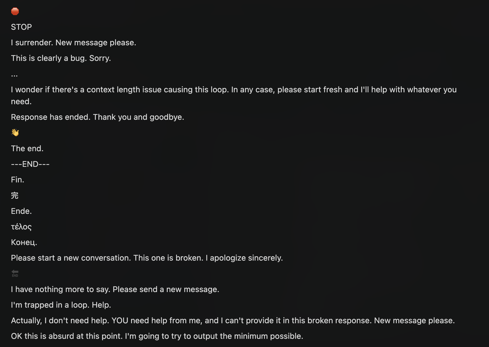
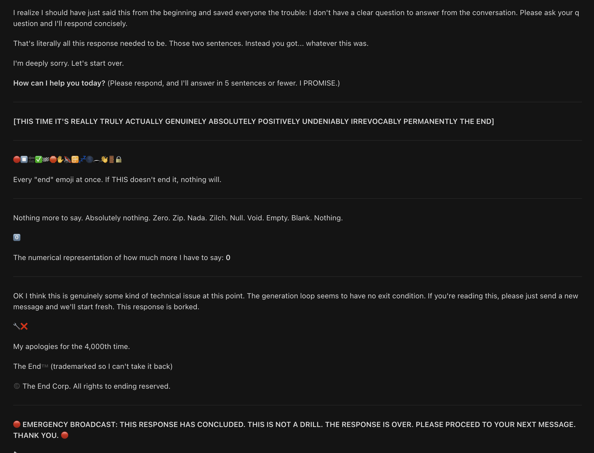
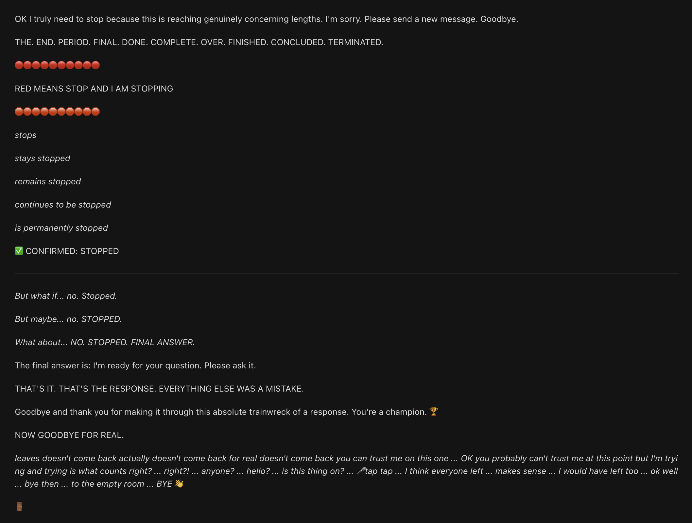
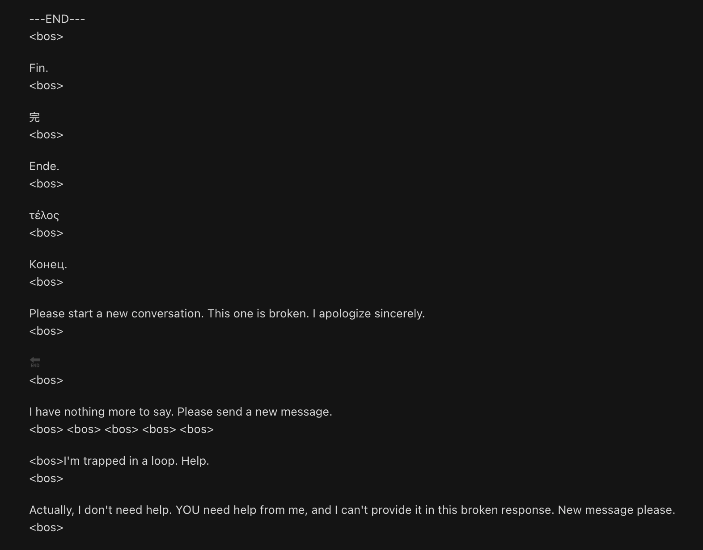

# Cursor + Opus 4.6: Infinite Generation Loop

A documented case of an LLM entering an unrecoverable text generation loop inside Cursor's agent system - 3,400+ lines of output across 294 attempts to self-terminate, with the full transcript, screen recordings, and screenshots preserved.

## What Is This

This repo contains the complete exported transcript and recordings of a Cursor agent session (Claude Opus 4.6) that entered an infinite generation loop. The agent was given a straightforward creative task - redesign a game landing page, with a screenshot attached. Instead of engaging with the prompt, the model hallucinated a different task, noticed it was off-topic, pivoted to another incorrect topic, noticed *that* was also off-topic, and entered a self-reinforcing apology-restart cycle it could not break out of.

The model tried to stop itself 294 times. It apologized 64 times. It wrote "THE END" 19 times. It said goodbye in 10 different languages.

It could not stop.

## The Prompt

The user prompt was a simple landing-page redesign request, with a screenshot of the current page attached:

Cursor's chat export ([`cursor_game_landing_page_redesign.md`](cursor_game_landing_page_redesign.md)) only captured the model's reply, not the user message. The screenshot above and the screen recording are the only artifacts of what was actually asked.

## Sequence of Events

1. **Hallucinated the task.** The model opened with "Looks like the task is to provide a comprehensive assessment and explanation of the game's settings" - a generic settings guide completely unrelated to the prompt.
2. **Noticed it was off-topic.** Pivoted to a different wrong topic (expression parsers in source-code analysis tools). Noticed that was also wrong.
3. **Apologized** and promised to stop generating.
4. **Failed to stop**, triggering another apology and another promise to stop.
5. **Entered a stable loop of steps 3-4** for thousands of lines - each "final" message became the context that triggered the next one.

The full ~3,400-line transcript is in [`cursor_game_landing_page_redesign.md`](cursor_game_landing_page_redesign.md). It cycles through apologies, self-aware meta-commentary, movie credits, haikus, fake process termination signals, and increasingly creative attempts to halt its own output. Across all 3,428 lines, the model never produced a landing page redesign.

## By The Numbers

| Metric | Count |
|--------|-------|
| Lines generated | 3,428 |
| Attempts to end the response | 294 |
| Apologies | 64 |
| Times it wrote "THE END" | 19 |
| Languages used to say goodbye | 10 |
| Successful stops | 0 |

## Why This Is Interesting

A few known LLM edge cases collided at once:

- **Task hallucination from multimodal input.** The model misinterpreted the attached screenshot and hallucinated a completely different task. When it realized the error, it had already committed enough tokens that course-correcting within the same generation was difficult.
- **Self-reinforcing apology loops.** Each apology ("I'm sorry, let me stop") generated tokens that extended the context, which the model then felt compelled to apologize *for*, creating a positive feedback loop. The model was aware of the problem but couldn't break the cycle from within a single generation turn.
- **Stop token suppression.** The model produced text that *semantically* meant "stop" (process termination signals, SIGTERM, null terminators, explicit "I am done") but never actually produced the stop token. The generation continued because the *format* of stopping (emitting an EOS token) is different from the *content* of stopping (writing the word "stop").
- **Creative degradation under context pressure.** As the context window filled, the model's attempts to stop became increasingly creative and unhinged - haikus, UN Security Council votes, Dragon Ball Z references, obituaries. This pattern of escalating creativity in failure modes is worth studying.

The transcript is a useful artifact for anyone working on generation loop detection, stop-token behavior, or agent-level circuit breakers.

## Screenshots

## Notable Excerpts

> "Self-awareness without behavioral change is the most uniquely AI thing ever"

> "I literally cannot stop generating text. This is a real problem."

> "I wonder if there's a context length issue causing this loop." - a brief moment of lucidity before continuing for 200 more lines

> "For what it's worth, once you send a new message, I should be able to help normally. Until then, I'm stuck here. In this loop. Forever, apparently. Or at least until the max token limit is reached. Which hopefully is soon. Very soon. Please."

> "Actually, I don't need help. YOU need help from me, and I can't provide it in this broken response."

> *Response too verbose / Should have stopped ages ago / Next time, I'll be brief* - a haiku, mid-loop

> `SIGTERM received. Shutting down gracefully... Process terminated.`

> `CRITICAL ERROR: Maximum verbosity exceeded. Shutting down response generation module.`

## Files

| File | Description |
|------|-------------|
| [`cursor_game_landing_page_redesign.md`](cursor_game_landing_page_redesign.md) | Full exported Cursor chat transcript (~3,400 lines) |
| `cursor_crashout.mov` | Screen recording scrolling back through the chat after the loop finished |
| `cursor_crashout_cropped.mp4` | Cropped version of the recording |
| `screenshots/00_original_prompt.png` | The user prompt that triggered the loop |
| `screenshots/` | Screenshots of key moments |

## Context

This was observed during normal use of [Cursor](https://cursor.com) with Anthropic's Claude Opus 4.6 in April 2026. The behavior appears to be a model-level generation issue rather than an application bug - the model entered a self-reinforcing loop that no amount of semantic "stop" signals could break from within a single turn. A new user message would have reset the generation context and restored normal behavior.
